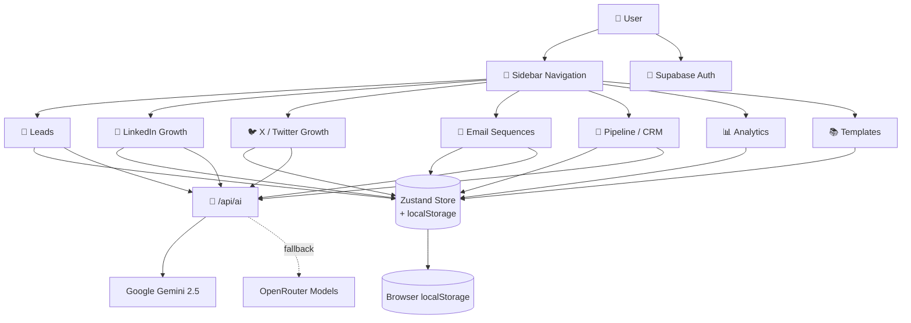

<div align="center">

# 🦅 LeadHawk

### **AI Sales Intelligence Platform**

*Lead generation, multi-channel outreach, CRM, and analytics — unified with AI.*

[](https://nextjs.org/)
[](https://www.typescriptlang.org/)
[](https://tailwindcss.com/)
[](https://github.com/pmndrs/zustand)
[](https://supabase.com/)
[](https://ai.google.dev/)
[](#)

[Features](#-features) • [Architecture](#-architecture) • [Quick Start](#-quick-start) • [Tech Stack](#-tech-stack) • [Modules](#-the-7-modules) • [Deploy](#-deployment)

</div>

---

## 🎯 What is LeadHawk?

**LeadHawk** is a production-grade SaaS platform that consolidates a B2B founder's outbound workflow into one AI-driven cockpit. Instead of juggling LinkedIn, Sales Navigator, email tools, a CRM, and an analytics dashboard, LeadHawk fuses all of it into seven tightly integrated modules powered by Google Gemini (with OpenRouter fallback).

> **Why it exists:** Founders and solo sellers waste hours context-switching between tools. LeadHawk replaces that fragmentation with a single, AI-first surface for prospecting, outreach, social growth, and pipeline management.

---

## ✨ Features

<table>
<tr>
<td width="50%" valign="top">

### 🎯 Lead Intelligence
- AI-generated **Sales Navigator filters** from plain-English ICP
- **9-archetype lead briefs** (founder, CEO, sales leader, etc.)
- Personalized hooks + pain points per archetype
- 4-tone outreach message generator

### 📱 LinkedIn Growth
- 6 post types (thought leadership, case study, tips, story, poll, engagement)
- **AI trending topics** with 48-hour TTL cache + trend scores
- 4 / 8 / 12-week growth strategy plans
- One-click composer pre-fill

### 🐦 X / Twitter Growth
- Single tweet + thread + reply generation
- Full thread builder (hook → setup → insights → CTA)
- 280-char enforcement with live counter
- Dedicated Twitter growth plans

</td>
<td width="50%" valign="top">

### 💼 Sales Pipeline (CRM)
- **7-stage Kanban** (new → contacted → replied → meeting → proposal → won/lost)
- **Sequence deep linking** — auto-trigger email sequences on "contacted"
- **Bulk CSV import** with validation + error recovery
- **Daily Action Queue** — smart follow-ups + meeting prep
- AI next-action suggestions

### 📧 Email Sequences
- Multi-step sequences (intro → value-add → follow-up → breakup)
- Auto-triggered when leads move to "contacted"
- Per-step subject, body, and delay configuration

### 📊 Analytics & Templates
- KPIs: Sent, Replies, Reply Rate, Meetings
- Channel breakdown (LinkedIn / Email / Twitter)
- **Reusable template library** with variables `{name}`, `{company}`, `{role}`
- Response & open-rate tracking per template

</td>
</tr>
</table>

---

## 🏗️ Architecture

LeadHawk is organized around **7 first-class modules**, each with its own page, components, and store slice — all unified by a shared AI router and Zustand state.



### Data Flow

```
Page  →  Component  →  Zustand action  →  localStorage
                  ↘
                    /api/ai  →  Gemini  →  (fallback) OpenRouter
```

---

## 🧩 The 7 Modules

| # | Module | Route | Purpose |
|---|--------|-------|---------|
| 1 | **Leads** | `/leads` | Filter builder + archetype-based lead briefs + outreach generation |
| 2 | **LinkedIn Growth** | `/linkedin-growth` | Trending topics + post generation + growth plans |
| 3 | **X / Twitter Growth** | `/twitter-growth` | Tweets, threads, and Twitter growth plans |
| 4 | **Email Sequences** | `/sequences` | Multi-step cold email sequences with auto-trigger |
| 5 | **Pipeline** | `/pipeline` | Kanban CRM, bulk import, daily action queue, sequence linking |
| 6 | **Analytics** | `/analytics` | Reply rates, meetings, channel performance |
| 7 | **Templates** | `/templates` | Reusable, variable-aware message library |

---

## 🔧 Tech Stack

<table>
<tr>
<td valign="top" width="33%">

**Frontend**
- Next.js 14 (Pages Router)
- React 18 + TypeScript 5.4
- Tailwind CSS 3.4
- Radix UI primitives
- Framer Motion
- Lucide icons
- react-hot-toast

</td>
<td valign="top" width="33%">

**State & Data**
- Zustand 4.5 (+ persist)
- Browser `localStorage`
- Supabase (auth)
- TypeScript-first data models

</td>
<td valign="top" width="33%">

**AI & Tooling**
- Google Gemini 2.5 Flash (primary)
- OpenRouter (fallback, model cycling)
- Vitest 4 (unit testing)
- ESLint + Next lint
- Custom JSON extractor

</td>
</tr>
</table>

---

## 🚀 Quick Start

### 1. Install

```bash
git clone <repo-url>
cd leadhawk
npm install
```

### 2. Configure environment

Create `.env.local`:

```bash
# Recommended (free tier, generous limits)
GOOGLE_API_KEY=your_gemini_key_here

# Optional fallback (free model cycling)
OPENROUTER_API_KEY=your_openrouter_key_here
OPENROUTER_MODELS=openai/gpt-4o-mini,meta-llama/llama-3-70b-instruct

# Optional Supabase auth
NEXT_PUBLIC_SUPABASE_URL=...
NEXT_PUBLIC_SUPABASE_ANON_KEY=...
```

> 🔑 Get keys: [Gemini](https://aistudio.google.com/apikey) · [OpenRouter](https://openrouter.ai/keys)

### 3. Run

```bash
npm run dev        # → http://localhost:3000
npm run build      # production build
npm start          # serve production build
npm run lint       # eslint
npm test           # vitest
```

---

## 📂 Project Structure

```
leadhawk/
├── src/
│   ├── pages/
│   │   ├── api/ai.ts              # AI router: Gemini → OpenRouter fallback
│   │   ├── index.tsx              # App shell + page routing
│   │   ├── leads.tsx              # Module 1
│   │   ├── linkedin-growth.tsx    # Module 2
│   │   ├── twitter-growth.tsx     # Module 3
│   │   ├── sequences.tsx          # Module 4
│   │   ├── pipeline.tsx           # Module 5
│   │   ├── analytics.tsx          # Module 6
│   │   └── templates.tsx          # Module 7
│   ├── components/
│   │   ├── layout/                # Sidebar, Header
│   │   ├── leads/                 # FilterBuilder, BriefGenerator, MessageGen
│   │   ├── linkedin/              # PostGenerator, GrowthPlan
│   │   ├── twitter/               # TweetGen, ThreadBuilder, GrowthPlan
│   │   ├── pipeline/              # SequenceDialog, ProgressDisplay, BulkImport, DailyQueue
│   │   └── shared/                # ProfileSetup
│   ├── lib/
│   │   ├── types.ts               # Single source of truth for data shapes
│   │   ├── store.ts               # Zustand global state + persistence
│   │   ├── ai.ts                  # AI generation functions + JSON extractor
│   │   ├── archetypes.ts          # 9 lead archetype profiles
│   │   ├── topicEngine.ts         # Trending topics + 48h TTL
│   │   ├── auth.tsx               # Supabase auth context
│   │   └── supabase.ts            # Supabase client
│   └── styles/globals.css         # Design tokens + utility classes
├── supabase/                      # Supabase config + migrations
├── CLAUDE.md                      # AI development guide
├── PROJECT_OVERVIEW.md            # Full project documentation
└── USER_GUIDE.md                  # End-user manual
```

---

## 🧠 AI Provider Architecture

LeadHawk uses an **automatic fallback** AI router at [src/pages/api/ai.ts](src/pages/api/ai.ts):

1. **Google Gemini** (primary) — `gemini-2.5-flash`, JSON mode supported
2. **OpenRouter** (fallback) — cycles through configured models on failure
3. Returns detailed, actionable errors when both fail

All client code calls a single `callAI(system, user, opts)` interface from [src/lib/ai.ts](src/lib/ai.ts), and a robust `extractJSON()` helper handles markdown fences, leading prose, and partial wrapping returned by models.

---

## 🎨 Design System

- **Theme:** Dark-first SaaS aesthetic (`#0b1020` base, `#1e293b` cards)
- **Brand colors:** `hawk-*` (indigo), `accent-*` (cyan, emerald, amber, rose)
- **Fonts:** Syne (display), DM Sans (body), JetBrains Mono (code)
- **Animations:** `fade-in`, `slide-up`, `pulse-slow`, `shimmer`
- **Shadows:** `glow-indigo`, `glow-cyan`, `card-hover`

---

## 🔑 Environment Variables

| Variable | Required | Purpose |
|----------|:--------:|---------|
| `GOOGLE_API_KEY` | ✅* | Google Gemini API key |
| `OPENROUTER_API_KEY` | ✅* | OpenRouter fallback API key |
| `GOOGLE_MODEL` | — | Gemini model ID (default: `gemini-2.5-flash`) |
| `OPENROUTER_MODELS` | — | Comma-separated OpenRouter model list |
| `OPENROUTER_MAX_TOKENS` | — | Token cap for OpenRouter (default: 800) |
| `NEXT_PUBLIC_SUPABASE_URL` | — | Supabase project URL (auth) |
| `NEXT_PUBLIC_SUPABASE_ANON_KEY` | — | Supabase anon key (auth) |
| `NEXT_PUBLIC_APP_URL` | — | App URL for OpenRouter referer header |
| `NEXT_PUBLIC_APP_NAME` | — | App name for OpenRouter referer header |

\* At least one AI provider key is required.

---

## 🗺️ Roadmap (Build Phases)

| Phase | Feature | Status |
|:-----:|---------|:------:|
| 1 | Lead Intelligence Engine (9 archetypes) | ✅ |
| 2 | Trending Topics Engine (48h TTL) | ✅ |
| 3 | X / Twitter Module (tweets + threads + plans) | ✅ |
| 4 | Analytics Dashboard | ✅ |
| 5 | Pipeline Sequence Deep Linking | ✅ |
| 6 | Money Features (Bulk Import + Daily Queue + Templates) | ✅ |
| 7 | Polish, QA & Type-safety pass | ✅ |
| 8 | Supabase migrations & sync scaffolding | ✅ |

---

## 🚀 Deployment

Recommended: **Vercel** (zero-config for Next.js).

```bash
npm install -g vercel
vercel
```

Then add your environment variables in **Vercel → Project → Settings → Environment Variables**.

Any host that supports Next.js 14 (Netlify, Render, self-hosted Node) will also work.

---

## ⚠️ Known Considerations

- **localStorage limits** — large datasets may approach browser quotas; production should sync to Supabase DB
- **AI cost** — Gemini free tier can rate-limit; OpenRouter free models also have caps
- **Sales Navigator** — requires an active LinkedIn Sales Navigator subscription
- **Trending topics** — auto-expire after 48 hours; refresh manually before expiry
- **Sequence trigger** — auto-dialog fires on transition to "contacted" only; manual linking always available

See [CLAUDE.md](CLAUDE.md) for the full list and architectural notes.

---

## 📚 Further Reading

- [CLAUDE.md](CLAUDE.md) — Development guide & architectural conventions
- [PROJECT_OVERVIEW.md](PROJECT_OVERVIEW.md) — Full project documentation
- [USER_GUIDE.md](USER_GUIDE.md) — End-user manual
- [DIAGNOSTIC.md](DIAGNOSTIC.md) — Health checks & troubleshooting

---

<div align="center">

**Built with Next.js · TypeScript · Tailwind · Gemini**

*If LeadHawk helped you ship more outbound, drop a ⭐ on the repo.*

</div>
